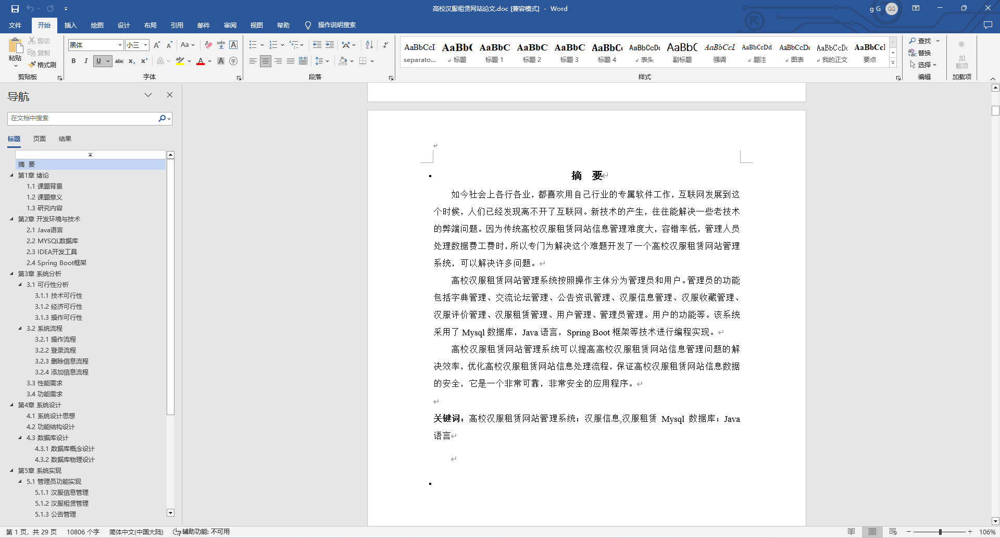
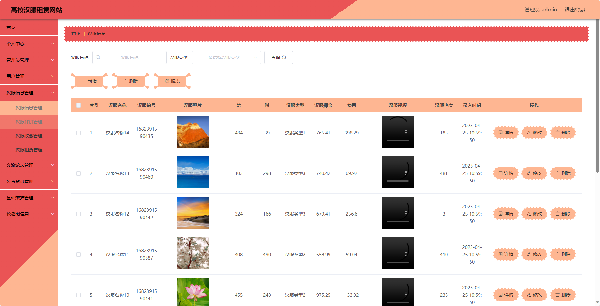
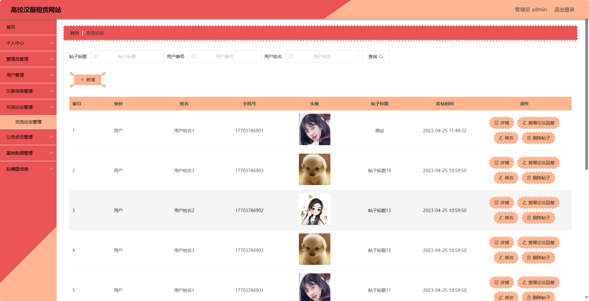
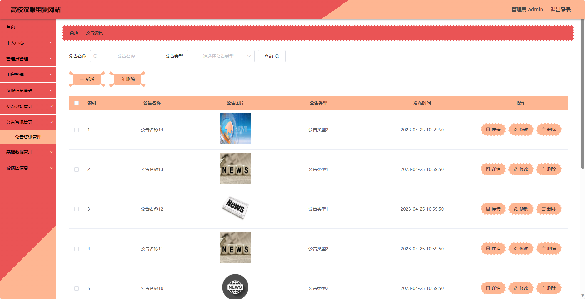
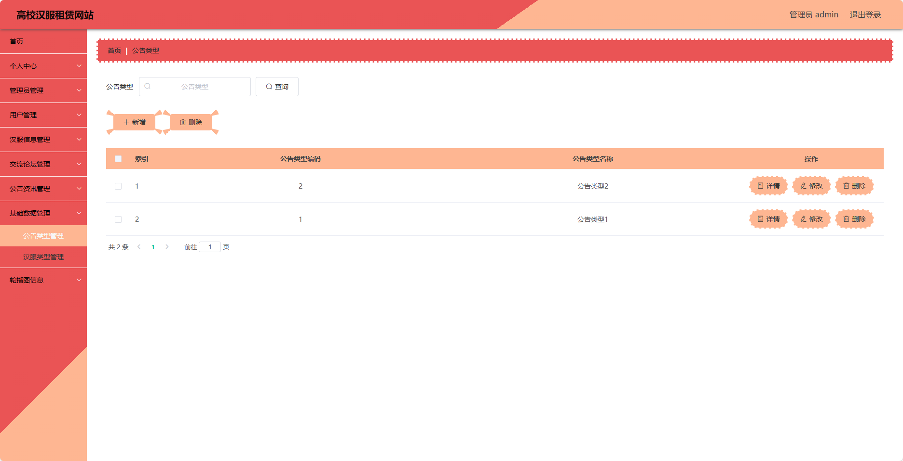

## 基于SpringBoot的高校汉服租赁网站(程序+报告)

###  获取sql数据库文件: 从戎源码网 (https://armycodes.com/) QQ: 386869957 QQ群: 377586148
###  所有系统地址: (https://github.com/YuLin-Coder/AllProjectCatalog) 
###  所有项目以及源代码本人均调试运行无问题 可支持远程安装部署调试、定制修改、代码讲解

## 项目介绍
基于SpringBoot的高校汉服租赁网站，系统包含两种角色：管理员、用户,系统分为前台和后台两大模块，主要功能如下。

### 【管理员】:
1. 个人中心：管理员可以管理个人信息，包括修改密码、查看个人资料等。
2. 管理员管理：管理员可以对其他管理员进行管理，包括添加、编辑、删除管理员账号等操作。
3. 用户管理：管理员可以对用户进行管理，包括查看用户列表、禁用用户账号等操作。
4. 汉服信息管理：管理员可以管理汉服的信息，包括添加、编辑、删除汉服信息等操作。
5. 交流论坛管理：管理员可以管理交流论坛的帖子和评论，包括审核、删除不当内容等操作。
6. 公告资讯管理：管理员可以管理公告资讯的发布和编辑，包括添加、编辑、删除公告等操作。
7. 基础数据管理：管理员可以管理网站的基础数据，包括汉服分类、活动标签等的添加、编辑、删除等操作。
8. 轮播图信息：管理员可以管理网站首页的轮播图信息，包括添加、编辑、删除轮播图等操作。

### 【前台】:
1. 汉服首页：展示网站的主页。
2. 交流论坛：提供一个汉服爱好者的交流平台。
3. 公告资讯：发布网站相关的公告和资讯。
4. 汉服信息：展示各种类型的汉服。
5. 个人中心：用户可以管理个人信息。

## 项目技术
- 编程语言：Java
- 数据库：MySQL
- 项目管理工具：Maven
- 前端技术：HTML、CSS、JavaScript、Jquery、Vue
- 后端技术：Spring、SpringMVC、MyBatis

## 运行环境
- JDK版本：JDK1.8及以上
- 开发工具：IDEA、Ecplise、Myecplise都可以
- 数据库: MySQL5.7及以上
- Maven：maven3.0及以上
- Node：14.14.0及以上

## 运行截图

